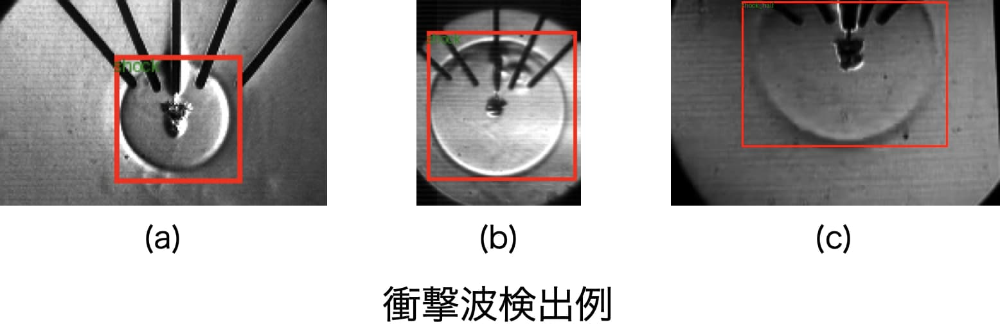
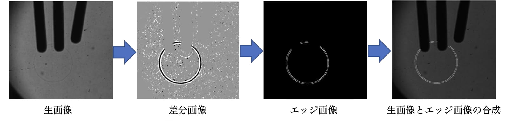

# CenterNet による衝撃波検出

## 1. 研究概要

流体実験の観測では、高速カメラによって膨大な画像データが取得されます。衝撃波が写った画像を人手で抽出するには多大な時間を要するという課題がありました。本研究では、**CenterNet** を用いて、全体が写っている衝撃波（a, b）から一部が見切れた衝撃波（c）までを検出するモデルを構築しました。これにより、従来の手作業による解析コストを大幅に削減し、データ解析の自動化を実現しました。

  

**参考論文**
- Xingyi Zhou, Dequan Wang, Philipp Krähenbühl, **Objects as Points**, 2019  
  http://arxiv.org/abs/1904.07850

---

## 2. 検出精度向上のための工夫
エッジが不明瞭かつ形状が多様な衝撃波を、限られたデータセットで高精度に検出するため、以下の3点を導入しました。

### 2.1 認識モデル選定
衝撃波はアスペクト比（縦横比）やサイズが多様なため、従来のアンカー枠（YOLOやSSD等）では適合が困難でした。CenterNetは、ヒートマップから中心点を特定しサイズを直接回帰する「アンカーフリー方式」を採用しています。これにより、形状変化に強く、多様な衝撃波を高い精度で検出することが可能になりました。

<table align="center">
  <thead>
    <tr>
      <th>モデル</th>
      <th>方式</th>
      <th>メリット</th>
      <th>デメリット</th>
      <th>採用</th>
      <th>リンク</th>
    </tr>
  </thead>
  <tbody>
    <tr>
      <td>CenterNet</td>
      <td>アンカーフリー</td>
      <td>形状変化に強く、アンカー設計が不要</td>
      <td>学習収束に時間を要する</td>
      <td>⭕️</td>
      <td>---</td>
    </tr>
    <tr>
      <td>SSD</td>
      <td>アンカーベース</td>
      <td>リアルタイム性が高い</td>
      <td>アンカーの事前設計が必要、形状変化に弱い</td>
      <td>❎</td>
      <td>---</td>
    </tr>
    <tr>
      <td>YOLOv3</td>
      <td>アンカーベース</td>
      <td>リアルタイム性が高い</td>
      <td>アンカーの事前設計が必要、形状変化に弱い</td>
      <td>❎</td>
      <td>---</td>
    </tr>
  </tbody>
</table>

### 2.2 画像前処理
生画像を直接にモデルに入力するのではなく、以下の３段階の前処理を施した画像を学習および推論に使います。これにより、モデルが衝撃波の固有特徴を効率的に学習でき、検出精度の向上を実現しました。
- Step1（背景差分）：画像差分により静止背景を排し、衝撃波の動的な変化のみを抽出。
- Step2（エッジ抽出）：Canny法によって、衝撃波のエッジ位置を抽出する。
- Step3（特徴統合）：生画像とエッジ抽出画像を合成。元の画像情報を保持しつつ、エッジ位置を強調することで、モデルの幾何学的特徴の学習を補強。

  

### 2.3 ２段階の転移学習
小規模な実験データにおける過学習を抑制し、汎化性能を高めるために２段階のアプローチを採用しました。
- **Stage 1（事前学習）**: `VOC2007 + VOC2012`を用い、一般的な物体特徴（エッジ、テクスチャ、形状）を学習。
- **Stage 2（ファインチューニング）**: 衝撃波データセットでファインチューニング。\
  Stage2の学習率を Stage 1 の 1/10 に設定し、50 epoch かけて衝撃波特有の形状に最適化。

---

## 3. 結果と考察

評価指標において、以下の高い精度を達成しました。 
- mAP@0.50: **97.5%**
- mAP@0.50:0.95: **83.3%**  

本手法により、実験画像に含まれるほぼ全ての衝撃波を正確に検出することが可能となりました。\
前処理と転移学習の最適化により、輪郭が曖昧な対象や、画像端で一部が欠損している衝撃波に対しても、安定したバウンディングボックスの推定が可能です。

## 4. 導入効果と今後の課題
### 導入効果

本研究の成果により、100個の実験データの解析に要する時間は**従来の1/10**へと短縮されました。  
これにより、これまで**2週間を要していた作業を1日以内**に完了させることが可能となり、研究の効率化に大きく貢献しました。

### 今後の課題（Todo）

- セグメンテーションへの拡張: 矩形（Bounding Box）による位置検出に留まらず、ピクセル単位で衝撃波の領域を特定する「セグメンテーション」を導入します。これにより、衝撃波の曲率や面積の自動計測など、より詳細な定量解析を実現します。
- 検出対象増加：衝撃波だけでなく、キャビテーションや渦運転など、他の流体現象も識別・検出できるようモデルを構築します。

